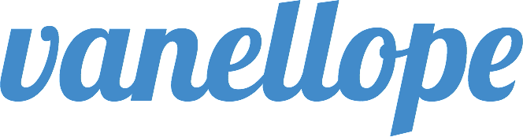

  

> A personal blog site solution designed to be deployed with a minimal effort.

## Setup basic development environment

1. Install the latest version of Docker
2. Enter the base directory and run `make run_dev`
3. Open `http://localhost:9099` in web browser (manually refresh may required)
4. In order to preview on another port, change `DEV_PORT` in Makefile.variable`, repeat Step-2

## Setup control panel development environment

1. Enter `control-panel`, this is a standard [vuejs](https://vuejs.org/) project.
2. Run `npm install` to install dependencies. You can skip this step if you already done that.
3. Run `npm run dev` to start.

## Add database table

1. Add new table schema in `create_table_sql` in config.py
2. Restart application will initiate the new table
3. Add new query interface in `da`, which means `DataAccess`
